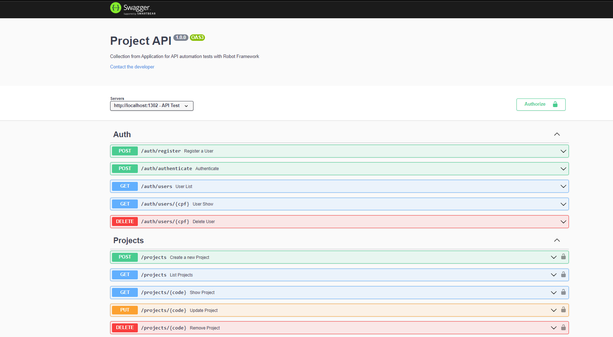

<h1 align="center">some *blue* text</h1>

Project to demonstration of test cases API using Robot Framework that were shown at TDC Innovation 2022

## :computer: App Develop

This application has to objective to teach about API Test Automation using the Robot Framework during a Masterclass at Sensedia Academy. Using Node.js and Mongo DB, were development a two APIs where the first create and authenticate a user through of a token. The second API performs a CRUD of a Project.

### Download MongoDB Community Server :memo:
To run the application, you need install Mongo DB (case you don’t installed).

   Download in: [MongoDB Community Server](https://www.mongodb.com/try/download/community) 

On the page, choose your OS and download (as in the image)

and then do the standard Windows install: next, next, finish.

With Mongo installed, open your terminal and type **mongod** to run your Mongo server.

### Node :notebook_with_decorative_cover:
   Download in: [Node js](https://nodejs.org/en/download/)

**1 - Download Windows Installer**

First, you need to download the Windows Installer (.msi) file from the official Node.js website. This MSI installer database carries a collection of installer files essential to install, update, or modify the existing Node.js version.

Notably, the installer also carries the Node.js package manager (npm) within it. It means you don’t need to install the npm separately.

When downloading, select the correct version as per your operating system. For example, if you’re using a 64-bit operating system, download the 64-bit version, and if you’re using the 32-bit version, download the 32-bit version:

**2 - Begin the Installation Process**

Once you open and run the .msi file, the installation process begins. But you have to set a few parameters before running the installation process.

Double-click on the installer file and run it. The installer will ask you to accept the Node.js license agreement. To move forward, check the “I accept” box and click Next:

Then, select the destination where you want to install Node.js. If you don’t want to change the directory, go with the Windows default location and click the Next button again.

The next screen will show you custom setup options. If you want a standard installation with the Node.js default features, click the Next button. Otherwise, you can select your specific elements from the icons in the tree before clicking Next:

Node.js offers you options to install tools for native modules. If you’re interested in these, click the checkbox to mark your preferences, or click Next to move forward with the default:

**3 - Run Node.js Installation on Windows**

Lastly — and this is the easiest part of all — click the Install button to begin the installation process:

The system will complete the installation within a few seconds or minutes and show you a success message. Click on the Finish button to close the Node.js installer.

**4 - Verify Node.js Installation**

So the installation process is completed. Now, you have to check whether Node.js is successfully installed or not.

To verify the installation and confirm whether the correct version was installed, open your PC’s command prompt and enter the following command:
        
        Node --version

And to check the npm version, run this command:

        npm --version

If the Node.js version and npm are correctly installed, you’ll see the version name in the CMD prompt.

***For Mac and Linux installation visit:* https://kinsta.com/blog/how-to-install-node-js/**

### Running Application :four_leaf_clover:
With our database and Node installed and configured, now let's install the necessary packages and run the application. In your IDE's terminal, run the script below:

* **To install project dependencies:**

        npm install

* **To run the application server:** 

        npm start

* **To access API documentation:**

     [Swagger](http://localhost:1302/api-docs/)

This is the image you should see in your IDE's terminal:

And in browser:

## :mortar_board: Robot Project - Test API whit Robot Framework 

This project has to objective to teach about API Test Automation using the Robot Framework. We'll testing two APIs where the first create and authenticate a user through of a token. The second API performs a CRUD of a Project.

### Download and Install Python :snake:
To run the application, you need install Python 3 (case you don’t installed).

   Download in: [Python 3](https://www.python.org/downloads/)

On the page, choose your OS and download (as in the image)

Check the option "Add Python 3.10 to PATH" for create the environment variable of Python, click in **Install Now** and then do the standard Windows install: next, next, Close.

To confirm the install, open the cmd and enter **python --version**

then enter **pip --version** to verify if pip was installed

### Installing the Robot Framework :robot:
   In cmd enter: **pip install robotframework**

To confirm the install, open the cmd and enter **robot --version**

### Installing Selenium Libraries :books:
  
  To run our API tests, it is necessary to install the libraries:
  
* **Selenium Library**
   
   In cmd enter: **pip install robotframework-seleniumlibrary**

* **Requests Library**
   
   In cmd enter: **pip install robotframework-requests**

### Running Tests :heavy_check_mark:

   To run or API tests, in cmd's project enter: **robot -d ./log path of test file**
        
        Where:

- **-d** *outputdir dir (Where to create output files. The default is the directory where tests are run from and the given path is considered relative to that unless it is absolute.)* 
- **./logs** *Create the folder where will be save the reports*
- **path of test file** *path containing the folder and the file that will be test* 

                For example: robot -d ./log test\user\register.robot

